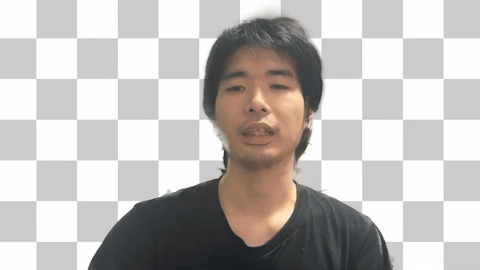

<!--
SPDX-FileCopyrightText: 2025-2026 Kaito Udagawa <umireon@kaito.tokyo>

SPDX-License-Identifier: Apache-2.0
-->

# Live Background Removal Lite

> A gaming-first, high-performance, and crash-resilient background removal for OBS Studio

## Overview

**Live Background Removal Lite** is a lightweight OBS effect filter plugin designed to remove backgrounds from your portrait sources.
We make resource consumption minimal to avoid affecting your gameplay, and we always develop this plugin with a priority on stability.

## Demo

*A cluttered background was removed from my portrait source.*

## Requirements

- **OBS Studio** 31.1.1 or later
- **OS** Windows, Mac, Linux (Ubuntu, Arch Linux, Flatpak)
- This plugin does not require CUDA or ROCm.

## Development policy

We prioritize the compliance and ethics of our software projects as a member of the global OSS community, and take the LLM concerns seriously.
While we use LLM-based code reviews to ensure that the quality of our software is satisfactory for every streamer, we always avoid including GenAI-generated content in our product, except for translations.

## Download and installation

You can get the binary from the project website on the GitHub Pages or the release page on the GitHub repository.

- **Windows:** Place the contents of the zip file into `C:\ProgramData\obs-studio\plugins`.
- **Mac:** Double-click the downloaded `.pkg`.
- **Ubuntu:** Install the provided `.deb`.
- **Arch Linux and Flatpak:** Use PKGBUILD or manifest available on [the supplementary repository](https://github.com/kaito-tokyo/live-plugins-hub).
- **Other Linux distributions:** Build from source.

## Technical details

1. **Motion detection** reduces a lot of computational cost when the portrait is still.
2. **Scaled resolution** (256x144) for matting keeps CPU load low and constant.
3. **Fast guided filter** [^1] [^2] is used to improve the quality of the generated mask.
4. **Temporal smoothing** can prevent the portrait from flickering.

## Acknowledgements

This project is built upon and incorporates several open-source components. We are grateful to the developers and contributors of these projects.

- **OBS Studio**: https://github.com/obsproject/obs-studio (License: [GPL-2.0](https://github.com/obsproject/obs-studio/blob/master/COPYING))
- **cURL**: https://github.com/curl/curl (License: [curl](https://curl.se/docs/copyright.html))
- **fmt**: https://github.com/fmtlib/fmt (License: [MIT](https://github.com/fmtlib/fmt/blob/master/LICENSE.rst))
- **GoogleTest**: https://github.com/google/googletest (License: [BSD-3-Clause](https://github.com/google/googletest/blob/main/LICENSE))
- **josuttis-jthread**: https://github.com/josuttis/jthread (License: [MIT](https://github.com/josuttis/jthread/blob/main/LICENSE))
- **MediaPipe Selfie Segmentation**: https://huggingface.co/onnx-community/mediapipe_selfie_segmentation (License: [Apache-2.0](https://opensource.org/licenses/Apache-2.0))
- **ncnn**: https://github.com/Tencent/ncnn (License: [BSD-3-Clause](https://github.com/Tencent/ncnn/blob/master/LICENSE.txt))
- **wolfSSL**: https://github.com/wolfSSL/wolfssl (License: [GPL-3.0](https://github.com/wolfSSL/wolfssl/blob/master/COPYING))
- **zlib**: https://zlib.net (License: [Zlib](https://zlib.net/zlib_license.html))

---

[^1]: He, Kaiming, Jian Sun, and Xiaoou Tang. “Guided Image Filtering.” IEEE Transactions on Pattern Analysis and Machine Intelligence 35, no. 6 (June 2013): 1397–1409. https://doi.org/10.1109/TPAMI.2012.213.
[^2]: He, Kaiming, and Jian Sun. "Fast Guided Filter." arXiv preprint arXiv:1505.00996 (2015). https://doi.org/10.48550/arXiv.1505.00996
